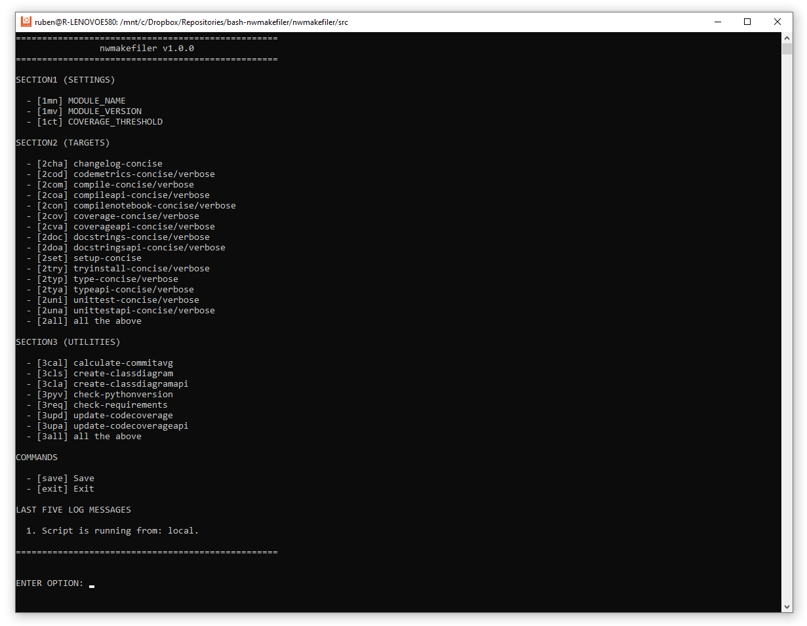

# nwmakefiler
Contact: numbworks@gmail.com

## Revision History

| Date | Author | Description |
|---|---|---|
| 2025-08-24 | numbworks | Created. |

## Introduction



`nwmakefiler` is a Bash script that interactively generates a `makefile` for a Python project using a menu interface.

## Getting Started

This script is intended to be used in two ways:

1. remotely, via:

```sh
bash <(curl -fsSL https://raw.githubusercontent.com/numbworks/nwmakefiler/refs/heads/master/src/nwmakefiler.sh)
```

2. locally, via:

```sh
ruben@R-LENOVOE580:/$ git clone https://github.com/numbworks/nwmakefiler.git
ruben@R-LENOVOE580:/$ cd nwmakefiler/src
ruben@R-LENOVOE580:/nwmakefiler/src$ ./nwmakefiler.sh
```

If run remotely, the script requires `curl` to be installed on the local machine.

## Architecture

This script assumes that your Python project is organized as in the following example:

```
...
\nwtraderaanalytics\scripts
\nwtraderaanalytics\scripts\makefile
...
\nwtraderaanalytics\src
\nwtraderaanalytics\src\nwtraderaanalytics.ipynb
\nwtraderaanalytics\src\nwtraderaanalytics.py
\nwtraderaanalytics\src\nwtraderaanalyticsapi.py
...
nwtraderaanalytics\tests
nwtraderaanalytics\tests\nwtraderaanalyticstests.py
nwtraderaanalytics\tests\nwtraderaanalyticsapitests.py
...
nwtraderaanalytics\CHANGELOG
nwtraderaanalytics\codecoverage.svg
nwtraderaanalytics\codecoverage.txt
nwtraderaanalytics\codecoverage_api.svg
nwtraderaanalytics\codecoverage_api.txt
...
```

This `makefile` produced by the script has four sections:

| Section | Type | Description |
|---|---|---|
| SETTINGS | Mandatory | Contains global variables used by the targets. |
| TARGETS | Optional | Contains the main targets. |
| UTILITIES | Optional | Contains additional "utility" targets. |
| AGGREGATES | Optional | Allow to run multiple targets with one command. | 

Some targets require your local machine (or your devcontainer) to have the following Python libraries installed:

```sh
pip install coverage==7.6.4
pip install parameterized==0.9.0
wget https://github.com/jgm/pandoc/releases/download/3.4/pandoc-3.4-1-amd64.deb \
    && dpkg -i pandoc-3.4-1-amd64.deb \
    && rm -f pandoc-3.4-1-amd64.deb

pip install mypy==1.13.0
pip install pandas-stubs==2.2.3.241009
pip install lxml-stubs==0.5.1
pip install radon==6.0.1
pip install pylint==3.3.3
pip install 'git+https://github.com/numbworks/nwpackageversions.git@v1.8.1#egg=nwpackageversions&subdirectory=src'
pip install 'git+https://github.com/numbworks/nwcommitaverages.git@v1.0.0#egg=nwcommitaverages&subdirectory=src'
pip install 'git+https://github.com/numbworks/nwdocstringchecking.git@v1.0.0#egg=nwdocstringchecking&subdirectory=src'
```

## Unit Tests

This script is accompanied by a suite of unit tests that you can run as follows:

```sh
ruben@R-LENOVOE580:/$ git clone https://github.com/numbworks/nwmakefiler.git
ruben@R-LENOVOE580:/$ cd nwmakefiler/tests
ruben@R-LENOVOE580:/nwmakefiler/src$ ./nwmakefilertests.sh
```

The outcome looks like this following:

```
...

test_validatecoveragethreshold_shouldreturnexpectedexitcode_wheninvalidgument
Passed: validate_coverage_threshold -1
Passed: validate_coverage_threshold 101
Passed: validate_coverage_threshold abc
Passed: validate_coverage_threshold

...

test_addtofunctionnamess1_shouldcontainexpecteditem_wheninvoked
Passed
Passed

...
```
## Appendix - Bash quirks

In this paragraph, I list some non-obvious aspects of Bash that I encountered during the development of this script.

**Indexed (numerical) arrays**:

```sh
declare options_s1_keys=("1mn" "1mv" "1ct")
declare -a options_s1_keys=("1mn" "1mv" "1ct")
```

**Associative (key-value) arrays**:

```sh
declare -A options_s1=(
    ["1mn"]="MODULE_NAME"
    ["1mv"]="MODULE_VERSION"
    ["1ct"]="COVERAGE_THRESHOLD"
)
```

**Remote script execution**:

The following method:

```sh
set_running_from() {
    if [[ "${BASH_SOURCE[0]}" == /dev/fd/* || "${BASH_SOURCE[0]}" == /dev/stdin ]]; then
        is_running_from="remote"
    else
        is_running_from="local"
    fi
}
```

is based upon the following piece of logic:

1. remote executions done with this command have `/dev/fd/*` as source:

    ```sh
    bash <(curl -fsSL https://raw.githubusercontent.com/numbworks/nwmakefiler/refs/heads/master/src/nwmakefiler.sh)
    ```

2. remote executions done with this command (and whatever other kind of piped execution) have `/dev/stdin` as source:

    ```sh
    curl -fsSL https://raw.githubusercontent.com/numbworks/nwmakefiler/refs/heads/master/src/nwmakefiler.sh | bash
    ```

The command in the scenario (2) doesn't work for this script (returns 'local' instead of 'remote'), due of the following costraint:

```sh
# MAIN
if [[ "${BASH_SOURCE[0]}" == "${0}" ]]; then
...
```

This costraint is required by `nwmakefilertests.sh` to source `nwmakefiler.sh` without executing the code.

This situation has even an impact on saving the makefile locally when the script is remote executed:

```sh
handle_save() {
    ...
    if [[ "$is_running_from" == "local" ]]; then
        script_dir="$(get_current_folder_path)"
        echo "$content" > "$script_dir/makefile"
    else
        echo "$content" > "makefile"
    fi
    ...
}
```

Without this conditional, the remotely executed script would write the file to a non-existant path like `/dev/fd/makefile`, raising an error.

**Why printf over echo?**:

The following method uses `printf` instead of `echo`, because `printf` behaves consistently across all POSIX-compliant shells and it's accurate with newline handling:

```sh
create_target_from_remote() {
    ...

    if [[ $? -eq 0 ]]; then
        printf "%s\n" "$content"
    else
        echo "Target '$target_name' not found at remote URL '$remote_file'."
    fi
}
```

## Appendix - The makefile

Below an example of the `makefile` generated by the script:

- [makefile](ExampleFiles/makefile)

## Appendix - Supported Targets

All the supported targets are stored in the `data` sub-folder:

- [calculate-commitavg](../data/calculate-commitavg)
- [changelog-concise](../data/changelog-concise)
- [check-pythonversion](../data/check-pythonversion)
- [check-requirements](../data/check-requirements)
- [clear](../data/clear)
- [codemetrics-concise](../data/codemetrics-concise)
- [codemetrics-verbose](../data/codemetrics-verbose)
- [compileapi-concise](../data/compileapi-concise)
- [compileapi-verbose](../data/compileapi-verbose)
- [compile-concise](../data/compile-concise)
- [coverageapi-concise](../data/coverageapi-concise)
- [coverageapi-verbose](../data/coverageapi-verbose)
- [coverage-concise](../data/coverage-concise)
- [coverage-verbose](../data/coverage-verbose)
- [create-classdiagram](../data/create-classdiagram)
- [create-classdiagramapi](../data/create-classdiagramapi)
- [docstringsapi-concise](../data/docstringsapi-concise)
- [docstringsapi-verbose](../data/docstringsapi-verbose)
- [docstrings-concise](../data/docstrings-concise)
- [docstrings-verbose](../data/docstrings-verbose)
- [makefile-info](../data/makefile-info)
- [setup-concise](../data/setup-concise)
- [tryinstall-concise](../data/tryinstall-concise)
- [tryinstall-verbose](../data/tryinstall-verbose)
- [typeapi-concise](../data/typeapi-concise)
- [typeapi-verbose](../data/typeapi-verbose)
- [type-concise](../data/type-concise)
- [type-verbose](../data/type-verbose)
- [unittestapi-concise](../data/unittestapi-concise)
- [unittestapi-verbose](../data/unittestapi-verbose)
- [unittest-concise](../data/unittest-concise)
- [unittest-verbose](../data/unittest-verbose)
- [update-codecoverage](../data/update-codecoverage)
- [update-codecoverageapi](../data/update-codecoverageapi)

## Markdown Toolset

Suggested toolset to view and edit this Markdown file:

- [Visual Studio Code](https://code.visualstudio.com/)
- [Markdown Preview Enhanced](https://marketplace.visualstudio.com/items?itemName=shd101wyy.markdown-preview-enhanced)
- [Markdown PDF](https://marketplace.visualstudio.com/items?itemName=yzane.markdown-pdf)